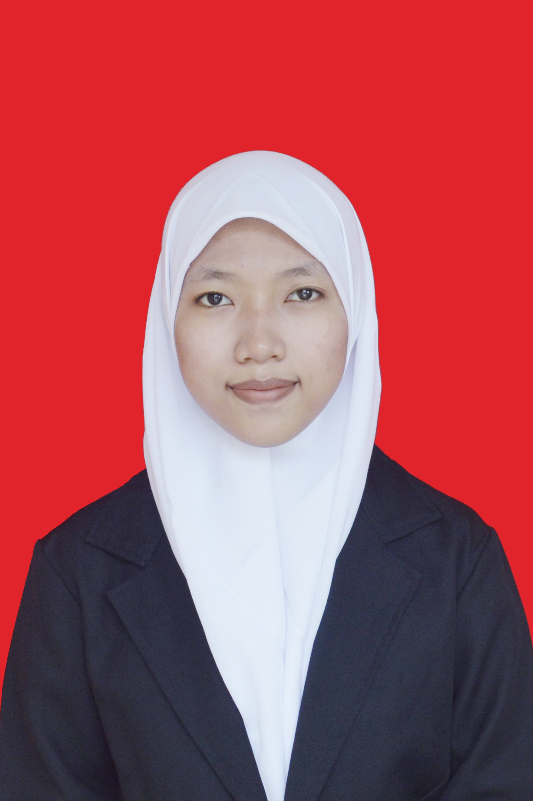

# tugaswebprofil_eloknuraida
Penugasan 3 Individu : Unggah Web Profil melalui GitHub
<!DOCTYPE html>
<html>
    <head>
        <title>Tugas Web Biodata Sederhana</title>
    </head>
    <body>
        <body style="background-color: rosybrown;"></body>
    </body>
    <h1 align="center">BIODATA DIRI</h1>
        <tr>
            

                <td rowspan="5">
            

        </tr>
        <table width="800" border="0" align="center" cellpadding="5">
            <tr>
             <td colspan="2">Profil
</td>
            </tr>
            <tr>
             <td width="50%" align="right">Nama:</td>
             <td>Elok Nuraida Kusuma Dewi</td>
            </tr>
            <tr>
             <td align="right">NIM:</td>
             <td>205150201111052</td>
            </tr>
            <tr>
             <td align="right">Tempat, Tgl Lahir:</td>
             <td>Magetan, 10 Juli 2002</td>
            </tr>
            <tr>
             <td align="right">Jenis Kelamin:</td>
             <td>Perempuan</td>
            </tr>
            <tr>
             <td align="right">Agama:</td>
             <td>Islam</td>
            </tr>
            <tr>
             <td align="right">Kewarnegaraan:</td>
             <td>Indonesia</td>
            </tr>
            <tr>
                <td align="right">Hobi:</td>
                <td>Lihat Anime, Drama dan Film</td>
               </tr>
            <tr>
             <td colspan="2">Link Sosial Media
</td>
            </tr>
            <tr>
             <td align="right" valign="top">Instagram:</td>
             <td>https://www.instagram.com/elok_nuraida/</td>
            </tr>
            <tr>
             <td align="right" valign="top">Twitter:</td>
             <td>https://twitter.com/ELELELLLLLLLLLL?s=08</td>
            </tr>
            <tr>
             <td align="right">Email:</td>
             <td>eloknuraidakd1@gmail.com 
                eloknuraidakd@yahoo.com</td>
            </tr>
            <tr>
                <td align="right">Line id:</td>
                <td>aoiyuki_</td>
            </tr>
            <tr>
                <td align="right">Nomor WA:</td>
                <td>083839300146</td>
            </tr>
            <tr>
             <td colspan="2">Pencapaian yang Dibanggakan
</td>
            </tr>
            <tr>
             <td align="right">Pencapaian:</td>
             <td>Bisa Lulus SMA dan berlanjut kuliah di UB Prodi Teknik Informatika 
                dan di bantu dengan KIP K mulai dari semester 2</td>
            </tr>
            <tr>
             <td align="right">Alasan:</td>
             <td>Untuk saya, bisa lanjut kuliah merupakan pencapaian yang bisa dibanggakan 
                melihat dari ekonomi keluarga saya yang hanya cukup saja. Dengan dibantu KIP K, 
                saya bangga bisa meringankan beban orangtua dalam membayar biaya kuliah.</td>
            </tr>
            <tr>
             <td colspan="2">Target yang akan dilakukan untuk mencapai impian
</td>
            </tr>
            <tr>
             <td colspan="2" align="justice" valign="top">
                Impian saya adalah menjadi orang sukses dimana saya dapat membantu orangtua dalam menanggung
                beban ekonomi keluarga agar dapat lebih berkecukupan lagi. Untuk mewujudkan impian ini,
                maka target saya adalah memahami pelajaran mata kuliah Prodi Teknik Informatika UB dengan seksama,
                lulus S1 dengan nilai yang memuaskan, lalu mencari kerja sesuai dengan keahlian dan bekerja secara profesional.</td>
            </tr>
           </table>
         </body>
</html>
